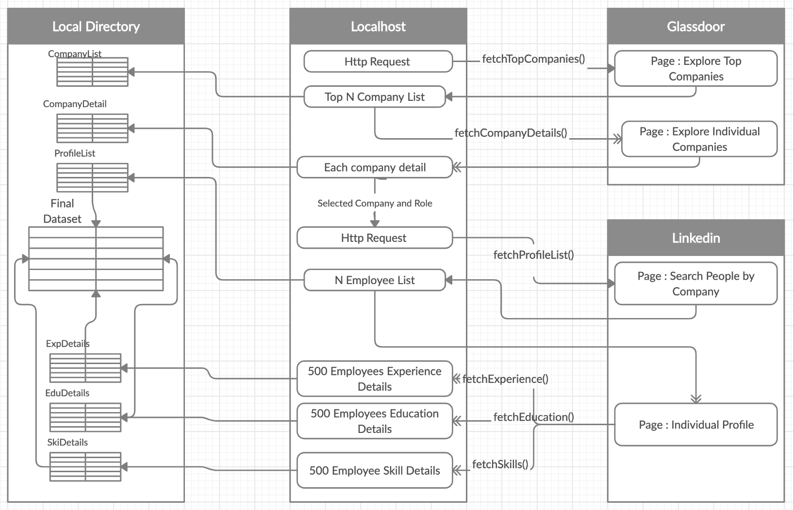
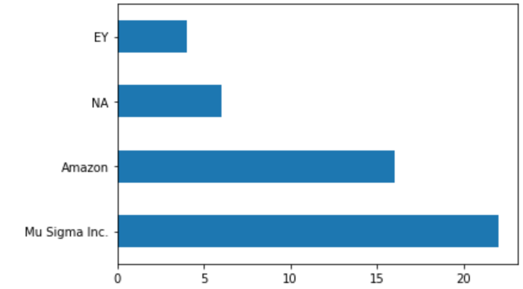
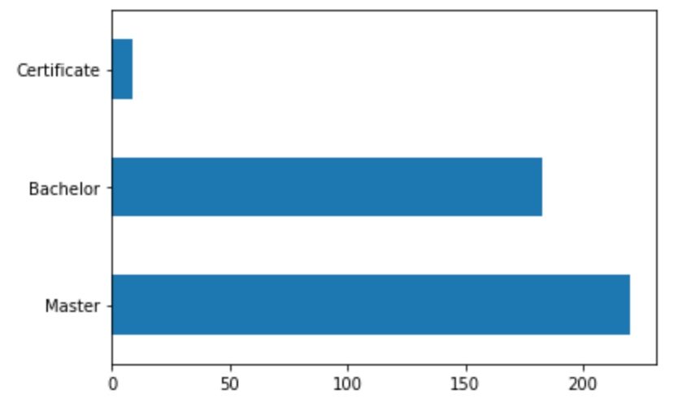
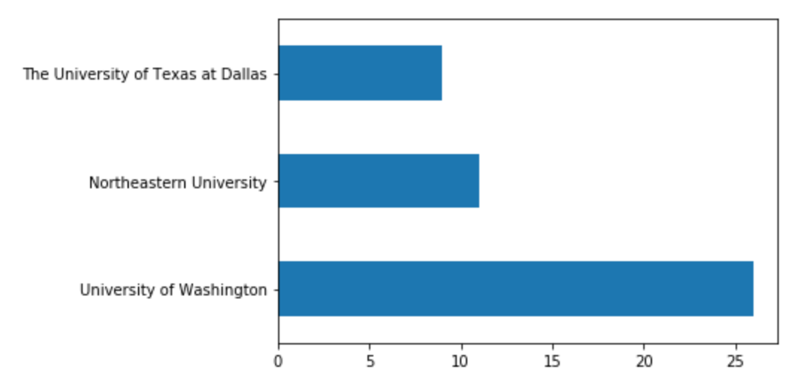
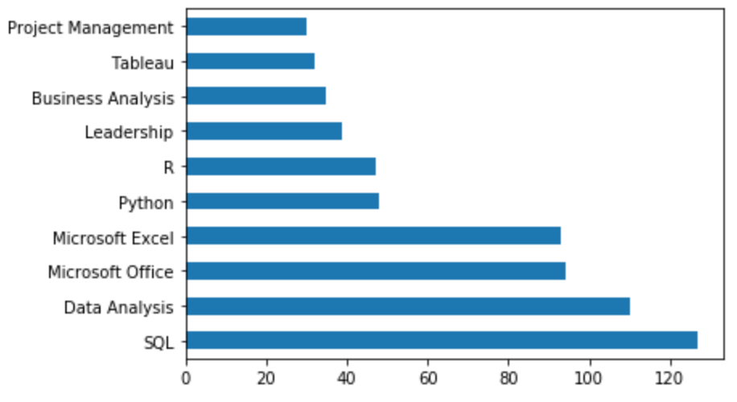

# Roadmap to your Dream Job/Role

## Objective 

The objective of this project is to create a clean dataset by acquiring data from different sets of employee profiles and companies inorder to analyze the recruiting pattern of a company based on location, universities,degree,courses and skillsets which could help people developing their career roadmap with a target to land up with their dream job.Any individual who wants to explore a new job role or switch career paths to get into one of the top companies, would not be aware of what the job role expects the person to have in terms of skillset, previous work experience, education background etc. The key reason for us to choose this subject for our term project is that we consider it to be an fascinating area in which obtaining and integrating various datasets can be challenging and it can also provide useful insights for the user that would want to work with this dataset.

Apart from collecting a clean dataset based on the company and the job role, we also wanted to create a framework which can be used to create dataset in a cross sectional manner where the user has an option to select the desired company and job roles as per the requirement. Moreover emphasis was laid on connecting various data source to create the workflow.

## Data Source
-  **Linkedin** 
LinkedIn is an American business and employment-oriented online service that operates via websites and mobile apps. Launched on May 5, 2003, it is mainly used for professional networking, including employers posting jobs and job seekers posting their CVs.


- **Glassdoor**
Glassdoor is a website where current and former employees anonymously review companies. Glassdoor also allows users to anonymously submit and view salaries as well as search and apply for jobs on its platform.

## Requirements
- Python V3.0
- Selenium 
- Chrome WebDrive
- BeautifulSoup
- Other basic library for data analysis.
- Linkedin Account


## Methodolgy

### API

As per the initial idea , we wanted to use the Linkedin API to fetch the data. In regards to Linkedin, an application is required to get the access token. We created a dummy application to get the access token which was used to fetch the profile information. As the application was a basic one , very limited access was given in terms of fetching the data.Below is a sample data which we were able to retrive from Linkeid. As we see the information fetched is limited because the allowed access were:
- r_liteprofile
- r_emailaddress
- w_member_social
 
```json
{
    "localizedLastName": "Anand",
    "profilePicture": {
        "displayImage": "urn:li:digitalmediaAsset:C5103AQH1phpino0LPA"
    },
    "firstName": {
        "localized": {
            "en_US": "Nishant"
        },
        "preferredLocale": {
            "country": "US",
            "language": "en"
        }
    },
    "lastName": {
        "localized": {
            "en_US": "Anand"
        },
        "preferredLocale": {
            "country": "US",
            "language": "en"
        }
    },
    "id": "1XDcZSyH0p",
    "localizedFirstName": "Nishant"
}
```
Inorder to access more profile related details we would need our appliaction to have privelege to access it by requesting Linkedin or by regsistering as a company by providing the details like website,company address etc.

### Web Scraping
Web Scraping was an alternative technique which we explored to retrieve data from the mentioned sources.
As we had to navigate between pages, we also incorporated Selenium framework.As its a term project, we limited the number of pages scraped and instead focused more on giving cross sectional capability by providing the user with an option to select companies and roles based on the list of top comapnies in United States which was retrived from Glassdoor.

## Process Flow
The below activity diagram illustrates the flow along with all the request,response,funations and the different tables generated as part of the whole flow.

<p align="center">

</p>

## Data Construction
All the packages required by the code are listed in the Jupyter Notebooks. 
(Install selenium using pip either in the notebook or through terminal)

Chrome Driver:
There is a code available for setting up the driver in the notebooks, which will automatically install the driver on the default location on your system.


The following steps were performed as part of the data construction process.

###  Glassdoor
There's no need to login into glassdoor inorder to run the code

**Step 1: From Glassdoor, we fetch the list of top N companies**

The function fetchTopCompanies() fetches the list of top N companies according to glassdoor along with the ratings and their page Url.

The details fetched was stored in *CompanyListXXXXXX.csv file*


**Step 2: Details of every company** 

We use the URLs fetched in Step 1 to retrieve the company-specific details like - Company ID, Company Name, Revenue, Headquarters, % of chancer for landing interviews through different channels, and % of positive and negative experiences of the interview, etc by calling *fetchCompanyDetail()* function.

The data fetched was stored as *CompanyDetailXXXXXX.csv*


**Step 3.: Select Company and JobRole to analyze**

There is a drop-down list from which we can select the company name and desired job role in that particular company based on the details fetched from Glassdoor.


### Linkedin


We need to have LinkedIn account with a few connections in order to fetch accurate profile details.
User ID and password must be entered inorder to land at the profile page.

Necessary permission is required to crawl LinkedIn, by requesting at email **whitelist-crawl@linkedin.com**

**Step 4: Fetch Employees list for the selected company and role**

Based on the input taken from Step 3, the N profile list pertaining to that particular job role in the selected company is fetched by calling *fetchProfileList()* function.


**Step 5: Fetch details for each employee**

Once the list is fetched, from this list, for every employee, the skill, education, experience background details are fetched using the functions *fetchExperience(),fetchEductaion(),fetchSkills()* resulting in details like  degree,university,course,company,role,duaration etc

The data fetched was stored as *EduDetailsXXXXXX.csv, ExpDetailsXXXXXX.csv and SkiDetailsXXXXXX.csv*

**Step 6: Data Exploration -Education/Experience** 

From the same employee list, Work Experience details are fetched resulting in the details like Last Company Name, Number of months worked, Last Job title, Last location of work, Last Degree, Last Course, Last University, etc before joining a company.


**Step 7: Data Exploration -Skills**  

For every employee, details of their top skills as per LinkedIn are fetched giving a table containing the name of the skills that every employee has updated.


**Step 8: Data Preprocessing/Cleaning**

Once all the data is fetched, it is pre-processed in order to retain relevant and important information using regex functions for term extraction.


**Step 9: Final Dataset**

All the tables are then integrated into a final data frame concluding to be the final dataset.


## Data Dictionary

```json
{
  "CompanyList": {
    "CompanyName": "Name of the company",
    "Ratig": "Company's overall rating",
    "Link": "Glassdoor link of the company"
  },
  "CompanyDetail": {
    "CompanyName": "Name of the company",
    "CompanyWebsite": "Official Website of the company",
    "Headquarters": "Headquarters of the company",
    "Size": "Employee size",
    "Founded": "Year in which the compnay was founded",
    "Type": "Industry Type",
    "Industry": "Industry details",
    "Revenue": "Overall revenue",
    "%_Positive_Interview_Experince": "On Scale of 100 , %_Positive_Interview_Experince",
    "%_Neutral_Interview_Experince": "On Scale of 100 , %_Neutral_Interview_Experince",
    "%_Negative_Interview_Experience": "On Scale of 100 , %_Negative_Interview_Experience",
    "%_interviews_through_appliedOnline": "On Scale of 100 , %_interviews_through_appliedOnline",
    "%_interviews_through_employeeReferral": "On Scale of 100 , %_interviews_through_employeeReferral",
    "%_interviews_through_recruiter": "On Scale of 100 , %_interviews_through_recruiter",
    "%_interviews_through_campusRecruiting": "On Scale of 100 , %_interviews_through_campusRecruiting",
    "%_interviews_through_other": "On Scale of 100 , %_interviews_through_other",
    "%_interviews_through_staffingAgency": "On Scale of 100 ,%_interviews_through_staffingAgency ",
    "interview_difficulty_level!": "On Scale of 5 , interview_difficulty_level"
  },
  "ProfileList": {
    "ProfileId": "Linkedin Unique id for each profile",
    "Employee Name": "Name of the employee",
    "Company": "Company Name",
    "Job Title":"Job titile of the employee",
    "Location":"Work Location",
    "Link":"Unique Url for each profile"
  },
  "ExpDetails": {
    "Profile_Id": "Linkedin Unique id for each profile",
    "CompanyTitle": "Job titile of the employee for a particular company",
    "Date": "Start and End date for a particular title",
    "Duration": "Overall duartion for a particular title",
    "Location": "Location"
  },
  "EduDetails": {
    "Profile_Id": "Linkedin Unique id for each profile",
    "Course": "Course name",
    "Degree": "Degree detail ,like Masters/Bachelors",
    "Date": "Start and End date for an education",
    "University": "University Name"
  },
  "SkiDetails": {
    "Profile_Id": "Linkedin Unique id for each profile",
    "Skill": "Top skills as per LinkedIn"
  }
}
```


## Final Dataset

The data acquisition, preprocessing and integration of the dataset gives a final dataframe that consists of the following columns.
- Profile Id
- Employee Name
- Company
- Job Title
- Location
- Link
- Previous Company
- Previous Work Experience(in months)
- Last Education
- Last Degree 
- Last University
- Top Skills 


## Results

We selected **Amazon** as the Company and **Business Analyst** as the role to construct our dataset.
1. We observe that **Mu Sigma Inc,MicroSoft,EY** were the few previous employers of good number of employees of Amazon.


2. Only 5 out of more than 450 employees were having no previous work experience.It signifies the importance of previous work experience to get into Amazon as a Business Analyst.

3. Majority of the empoyee had experience between **1 and 5 years**.

4. **Masters degree** seems to be an importart factor to get employed as a Business Analyst at Amazon.


5. **University of Washington, Northeaster University and UTD** are the top Universities. These information would help any student to decide on the universities they want to attend.


6. **SQL, Data ANalysis, Microsoft Excel, Mocrosoft Office Python and R** are the top skills required to be successful as a Business Analyst.



## Challenges 

- The id and xpath changes dynamically due to which classes were used for reference and mutilple tries were used for each profile in order to handle different exceptions.

- New issues popped up with different set of profiles which was handled on the go.

- Multiple round of testing was required to check the robustness of the code with different combinations of company and role(at least 10 combination tested) .

- Each section on Linkedin loads seperately , thus we need to find an optimize sleep time as well as need to scroll the whole page to allow the data loading.

- Web page needs to be maximized and should be kept open throughout the process for data to load efficiently.

- For glassdoor, we were forced to use selenium inorder to navigate to different pages as the first page was loading in between all the pages when directly hitting the url because of which we were getting duplicate values. 

- While fetching details from glassdoor there were a few instances where an entire section was missing for the html tags (for example, the company link was missing for a few companies), because of which the code was breaking. We handled it by using if-else and try-except blocks.

- For the company details part, a few companies did not have a few information. We could handle these by using if-else block.

- Inorder to avoid a patterns in web scraping, random sleep intervals were used and the overall approximate computational time is listed below
    - Glassdoor -   5 Mins(250 Company List)
    - Glassdoor -   15 Mins(250 Company Details)
    - Linkedin  -  10 Mins(500 Profile List)
    - Linkedin  - 150 Mins(500 Profile Details)
    - Overall   - 3hrs

## Limitations

1. LinkedIn API key is not made public and hence it is difficult to obtain the AuthKey until we are registered by a company.

2. Webscraping is not allowed by LinkedIn,thus necessary permission is required to crawl LinkedIn, by requesting at email **whitelist-crawl@linkedin.com** with all the details.

3. IP Address should be white listed by the company for the data to be fetched rightfully.

4. Maximum number of profiles that could be fetched from LinkedIn is limited to 1000 profiles.

5. Linkedin account is required.


## Future Work

1. The details about the last university,location etc could be converted to pair of longitude and latitude which could help in visualzing pattern on map.
2. As we are fetching the details of the whole profile , we would add sections like accomplishments, certifications etc in the similar way as we did for sections like Skills,Eductaion etc.
3. Text Mining can be done on the Project section to understand the latest trend and ideas. 


6. Glassdoor/LinkedIN update their features on a regular basis. The code needs to be made more robust in order to handle these changes regularly.

7. Due to company's Terms of Use, this data cannot be used for any commercial/publishing purpose as mentioned in the disclaimer.

<span style="color:red">Disclaimer : This project and data is purely used for academic term-project purpose and will not used for any commercial/publishng purpose based on company's Terms of Use.</span>
